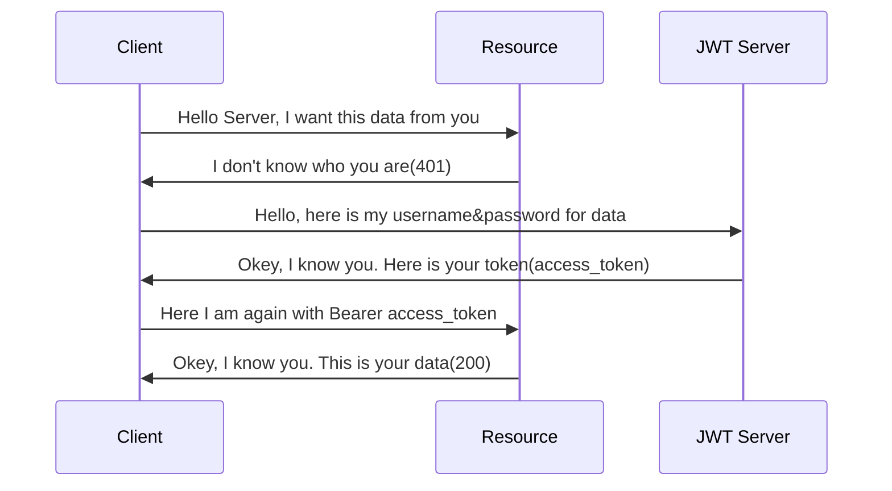

# Welcome to Login API!

In this example repository, you will be able to see KTOR based backend application working with a couple of techniques ;
- [KTOR](https://ktor.io/)
	> Kotlin based web framework.
- JWT
- [Exposed](https://github.com/JetBrains/Exposed)
  > ORM Framework for Kotlin.
- PostgreSQL

## JWT UML

In the example below, you see Json Web Token Authentication between client and server.

> **Note:** The **Login API** is working on current KTOR 2.0.1 version and working with dockerized PostgreSQL in development environment. If you want to use, please change configuration file inside resources file.
