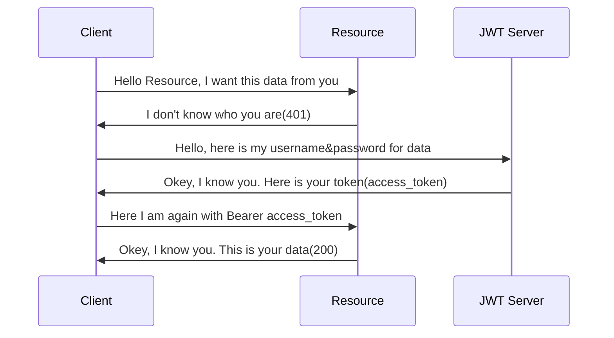

[](http://kotlinlang.org)
[](https://github.com/ktorio/ktor)
[](https://www.postgresql.org/)

# Welcome to Login API!

In this example repository, you will be able to see KTOR based backend application working with a couple of techniques ;

- [KTOR](https://ktor.io/)
  > Kotlin based web framework.
- [JWT](https://jwt.io)
- [Exposed](https://github.com/JetBrains/Exposed)
  > ORM Framework for Kotlin.
- [PostgreSQL](https://www.postgresql.org/)
- [Flyway](https://github.com/flyway/flyway)
  > Migration tool for database

## Installation

With docker, this application will be exposed on 8080 port.

```bash
docker compose build
docker compose up
```

## Environment Configuration

In [**
application.conf**](https://github.com/mfarkan/k-account-login-api/blob/master/src/main/resources/application.conf)
you will see some environment for working in local environment or if you want to run this app
in another database, you should change these configurations for your data;

- PORT
  > If you change this config, your application will be working on that port.
- JWT_SECRET
  > Secret for JWT creation.
- DB_PASSWORD
  > database password
- DB_CONNECTION
  > database connection string
- DB_USERNAME
  > database username

## JWT UML

In the example below, you see Json Web Token Authentication between client and server.



> **Note:** The **Login API** is working on current KTOR 2.0.1 version and working with dockerized PostgreSQL in
> development environment. If you want to use, please change configuration file inside resources file.
